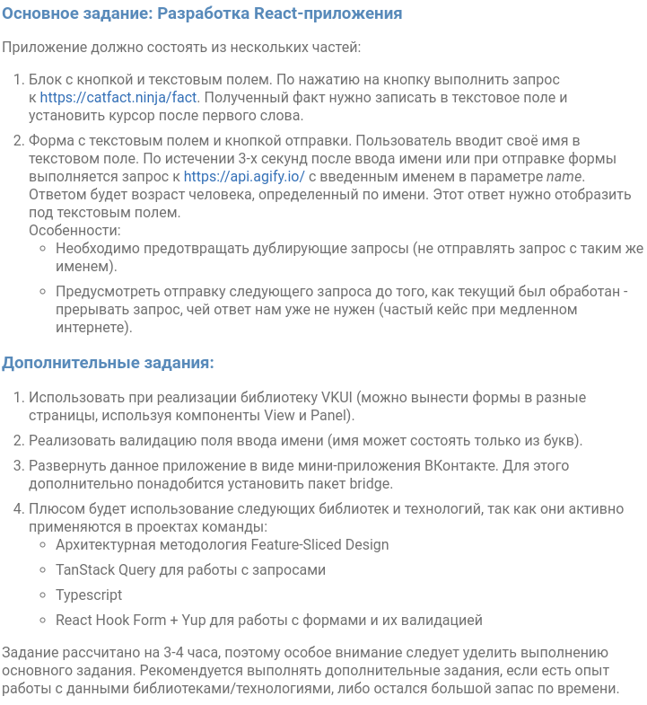

# Профильное задание на стажировку VK Фронтенд-разработчик

## Запуск

В директории проекта запустить:

### `npm start`

Открыть [http://localhost:3000](http://localhost:3000) в браузере.

## Задание

